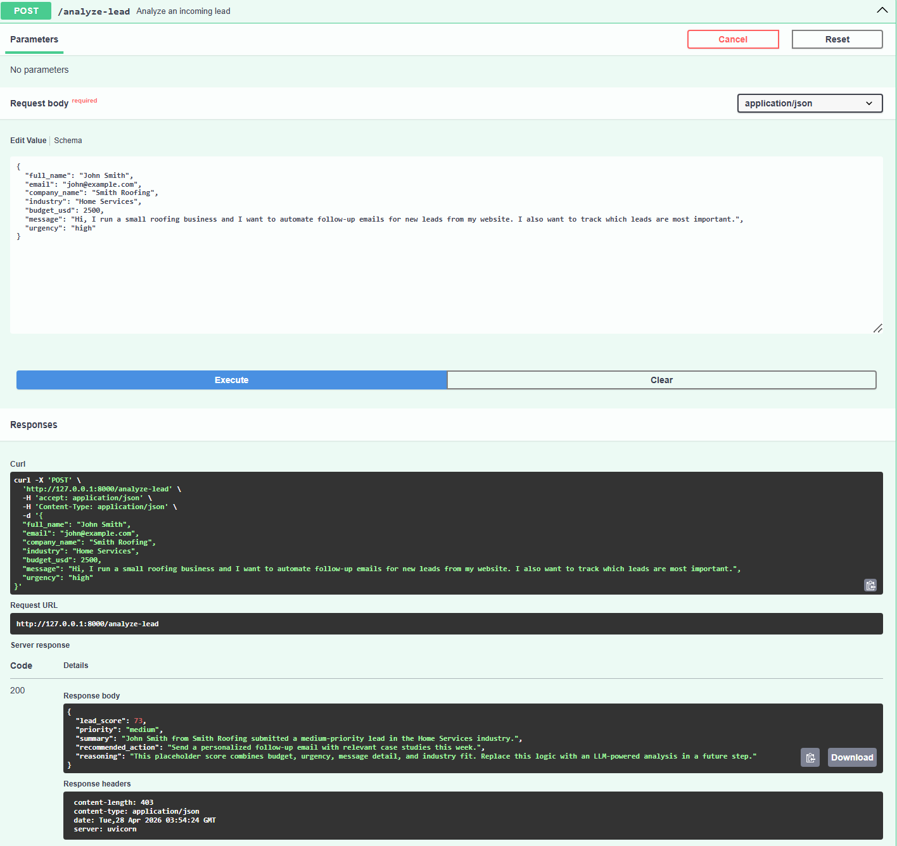

# AI Lead Form Analyzer (FastAPI)

A portfolio-ready Python backend API that receives website lead form submissions and returns an AI-powered lead analysis using the OpenAI API.

This version uses a **real OpenAI API call** with `gpt-4o-mini` to evaluate each lead and return structured analysis output.

## Project Structure

```text
.
├── app/
│   ├── main.py
│   ├── schemas/
│   │   └── lead_schema.py
│   └── services/
│       └── lead_service.py
├── .env.example
├── .gitignore
├── requirements.txt
└── README.md
```

## Tech Stack

- FastAPI
- Pydantic
- Uvicorn
- OpenAI Python SDK

## API Endpoint

- `POST /analyze-lead`

### Request Body

```json
{
  "full_name": "Jordan Lee",
  "email": "jordan.lee@acmecorp.com",
  "company_name": "Acme Corp",
  "industry": "SaaS",
  "budget_usd": 25000,
  "message": "We need automation support for lead qualification and CRM integration in the next quarter.",
  "urgency": "high"
}
```

### Response Body (Example)

```json
{
  "lead_score": 85,
  "priority": "high",
  "summary": "Jordan Lee from Acme Corp submitted a high-priority lead in the SaaS industry.",
  "recommended_action": "Schedule a discovery call within 24 hours and prepare a tailored proposal.",
  "reasoning": "This placeholder score combines budget, urgency, message detail, and industry fit. Replace this logic with an LLM-powered analysis in a future step."
}
```

### Screenshot

The screenshot below shows a successful POST /analyze-lead test in FastAPI Swagger UI.



## Getting Started (Beginner-Friendly)

### 1) Create and activate a virtual environment

Windows (PowerShell):

```powershell
python -m venv .venv
.venv\Scripts\Activate.ps1
```

macOS/Linux:

```bash
python3 -m venv .venv
source .venv/bin/activate
```

### 2) Install dependencies

```bash
pip install -r requirements.txt
```

### 3) Create your environment file

```bash
copy .env.example .env
```

On macOS/Linux use:

```bash
cp .env.example .env
```

Then open `.env` and set your OpenAI key:

```env
OPENAI_API_KEY=your_real_openai_api_key
```

Important: never commit `.env` to source control. This project already ignores `.env` via `.gitignore`.

### 4) Run the API

```bash
uvicorn app.main:app --reload
```

API base URL:

- [http://127.0.0.1:8000](http://127.0.0.1:8000)

### 5) Open automatic API docs

- Swagger UI: [http://127.0.0.1:8000/docs](http://127.0.0.1:8000/docs)
- ReDoc: [http://127.0.0.1:8000/redoc](http://127.0.0.1:8000/redoc)

## Skills Demonstrated

- FastAPI backend development
- REST API endpoint design
- Pydantic request and response validation
- OpenAI API integration
- Environment variable handling with `.env`
- API error handling
- Swagger UI testing
- Git/GitHub project workflow
- AI automation business use case: lead scoring and lead qualification

## Security Notes

- API keys are stored in `.env` locally
- `.env` is excluded from GitHub
- `.env.example` is used as a safe template
- The backend returns clear errors without exposing secrets

## Possible Improvements

- Add CRM integration
- Save analyzed leads to a database
- Add email notification for high-priority leads
- Add dashboard for reviewing leads
- Add authentication
- Deploy backend to a cloud service

## Project Status

Current version: working portfolio MVP with real OpenAI API integration.

This project demonstrates how AI can analyze website lead form submissions and help a business prioritize follow-up actions.

## Notes for Next Iteration

- Add unit tests for schema validation and scoring behavior.
- Add persistent storage for analyzed leads.
